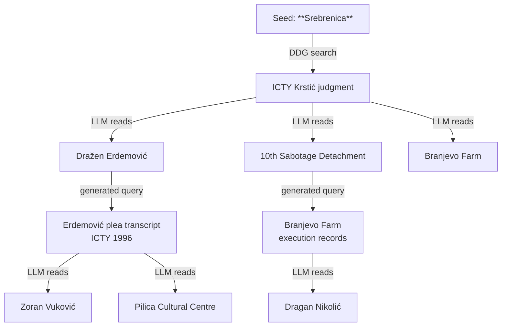
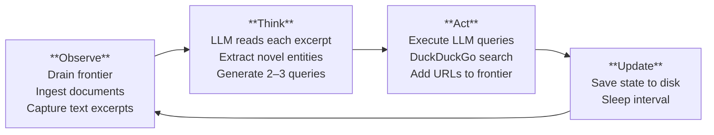

# Agentic Discovery

## What makes it genuinely agentic

`discover agent` puts an LLM in the search loop. After ingesting each document it reads an excerpt and reasons: *"What do I know now that I didn't before? What should I look for next?"*

This is the difference between the three discovery commands:

| Command | How it decides what to search | Reasoning |
|---|---|---|
| `discover fetch` | Fixed API queries on entity names | None — template substitution |
| `discover web` | Template queries + frontier priority scoring | Mechanical — priority maths |
| `discover agent` | LLM reads each document and generates novel queries | **Genuine reasoning** |

### Example snowball



Each document the agent ingests expands the entity graph and generates 2–3 new directions. No template would have produced `"Erdemović plea agreement ICTY 1996"` — it came from reading the Krstić judgment. The corpus builds itself from evidence.

## Quick start

```bash
# First run — discovers and starts reasoning
ai4saw discover agent "Srebrenica" "Mladic" "VRS" \
  --geography Bosnia --yes

# Run overnight — 20-minute sessions, LLM reasoning every session
ai4saw discover agent "Srebrenica" "Mladic" "VRS" \
  --geography Bosnia --loop --interval 1200 --yes

# Sudan corpus
ai4saw discover agent "El Geneina" "Masalit" "RSF" "Darfur" \
  --geography Sudan --loop --interval 1200 --yes

# Check what it's discovered
ai4saw discover agent "Srebrenica" --geography Bosnia --state

# Read the last 5 reasoning entries
ai4saw discover agent "Srebrenica" --geography Bosnia --log 5
```

## ReAct loop



Each session runs three phases. The frontier is the continuity mechanism. Every URL found — from initial seed queries, LLM-generated queries, or link following — goes into the frontier. Sessions drain it and replenish it.

### Phase 1: Observe

The agent visits the top-priority frontier items and ingests them. For each HTML page it follows embedded PDF and trusted-domain links. Text from each ingested document is captured for the reasoning phase.

### Phase 2: Think (LLM reasoning)

The top-N ingested documents (by relevance score) are passed to the LLM with this context:

- Initial research entities
- Geography and domain
- First 2,000 characters of document text
- All entities already tracked (to avoid duplication)

The LLM returns:

```json
{
  "novel_entities": ["Dražen Erdemović", "10th Sabotage Detachment"],
  "queries": [
    "Dražen Erdemović plea agreement ICTY 1996",
    "10th Sabotage Detachment VRS Branjevo Farm executions July 1995"
  ],
  "reasoning": "Erdemović's testimony is the primary eyewitness account; his unit directly carried out the executions"
}
```

Novel entities are registered in state and added to future searches. Queries are queued for Phase 3.

### Phase 3: Act

LLM-generated queries are executed via DuckDuckGo (up to 5 per session). Results enter the frontier with elevated priority — these are targeted, specific searches, not broad templates.

## Persistent state

All state is written to `output/agent_discover_state.json` between sessions. Restarts pick up exactly where the agent left off.

| Field | What it stores |
|---|---|
| `visited_urls` | Every URL attempted, with timestamp and chunk count |
| `frontier` | Priority queue of URLs to visit next |
| `discovered_entities` | Entities found by LLM reasoning (not in initial list), with source URL |
| `query_queue` | LLM-generated queries pending execution |
| `executed_queries` | Already-run queries (deduplication) |
| `domain_scores` | Hit rate per domain |

## Reasoning log

Every LLM reasoning call is appended to `output/agent_discover_log.jsonl`:

```jsonl
{"source_url": "https://icty.org/...", "source_title": "Krstić Trial Judgment", "novel_entities": ["Dražen Erdemović", "10th Sabotage Detachment"], "generated_queries": ["Dražen Erdemović plea ICTY 1996", ...], "reasoning": "Erdemović is the primary execution witness...", "timestamp": "2026-06-01T14:22:00Z"}
```

Read the last N entries:

```bash
ai4saw discover agent "Srebrenica" --geography Bosnia --log 10
```

This gives full transparency into the agent's reasoning chain.

## Options

| Flag | Default | Description |
|---|---|---|
| `--geography` | required | Geography tag for chunk metadata |
| `--min-relevance` | 0.4 | Minimum frontier priority to ingest |
| `--frontier-batch` | 20 | Frontier URLs to visit per session |
| `--per-entity-limit` | 10 | DDG results per template when seeding |
| `--seed-every` | 6 | Re-seed frontier via web discovery every N sessions |
| `--max-reasoning` | 8 | Max LLM reasoning calls per session |
| `--loop` | off | Run continuously until Ctrl-C |
| `--interval` | 1200 | Seconds between sessions (20 min default) |
| `--state` | off | Print state summary and exit |
| `--log N` | 0 | Print last N reasoning log entries and exit |

## Comparing all three discovery commands

```bash
# discover fetch — static API queries, good for a first bootstrap
ai4saw discover fetch "Srebrenica" "Mladic" \
  --geography Bosnia --max-docs 100 --yes

# discover web — stateful crawler, adapts query order, runs overnight
ai4saw discover web "Srebrenica" "Mladic" \
  --geography Bosnia --loop --interval 900 --yes

# discover agent — LLM reasoning loop, corpus builds from evidence
ai4saw discover agent "Srebrenica" "Mladic" \
  --geography Bosnia --loop --interval 1200 --yes
```

**Recommended workflow:** run `discover fetch` once to bootstrap, then `discover agent --loop` to let the reasoning agent grow the corpus from what it finds.

## Technical notes

- LLM calls use the active provider (`PROVIDER=ollama`, `openrouter`, or `huggingface`)
- Each reasoning call passes ~2,000 chars of document text — short enough to run on Mistral 7B
- 8 reasoning calls per session ≈ 1–2 minutes on Ollama/Mistral; < 30s on OpenRouter
- The agent respects existing `corpus/sources.csv` — never ingests the same URL twice
- Frontier cap: 5,000 URLs maximum (oldest low-priority items pruned)
