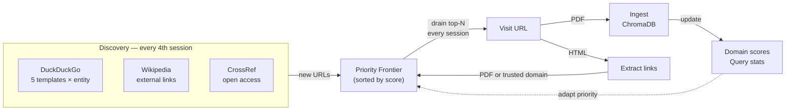

# Autonomous Web Agent

## Overview

`discover web` is a self-improving web crawler that searches, learns, and ingests documents continuously — with no API keys and no manual input.

Unlike `discover fetch` (which runs fixed API queries on a schedule), the web agent maintains **persistent memory** across sessions. It remembers every URL it has visited, scores which sources and query strategies produce the best results, and maintains a priority frontier of URLs still to explore.



The corpus grows continuously as the agent works through its backlog. Between discovery sessions it purely drains the frontier — no new API calls needed.

## Quick start

```bash
# First run: discover and build the frontier
ai4saw discover web "Srebrenica" "Mladic" "VRS" "Bosnia" \
  --geography Bosnia --yes

# Run overnight, re-querying every hour (4 × 15 min sessions)
ai4saw discover web "Srebrenica" "Mladic" "VRS" "Bosnia" \
  --geography Bosnia --loop --interval 900 --yes

# Sudan corpus
ai4saw discover web "El Geneina" "Masalit" "RSF" "Darfur" \
  --geography Sudan --loop --interval 900 --yes

# Check what the agent has learned
ai4saw discover web "Srebrenica" --geography Bosnia --state
```

## How it works

### Persistent state (`output/web_agent_state.json`)

The agent writes all state to a single JSON file between sessions:

| Field | What it stores |
|---|---|
| `visited_urls` | Every URL attempted, with timestamp and chunk count |
| `frontier` | Priority-ordered queue of URLs to visit next |
| `domain_scores` | Hit rate per domain (hits / attempts) |
| `query_stats` | New-doc yield per DuckDuckGo template |
| `session_count` | Total sessions run |

State survives crashes and restarts. Re-running the command picks up exactly where it left off.

### Priority frontier

Every new URL found — from DuckDuckGo, Wikipedia, CrossRef, or link following — is added to the frontier unless already visited. Priority combines:

- **Relevance score** (entity match in title/snippet)
- **Domain score** (historical hit rate for this domain)
- **PDF bonus** (+0.15 for `.pdf` URLs)
- **Trusted-domain bonus** (+0.10 for known NGO/legal/academic domains)
- **Depth penalty** (−0.10 per hop from original query)

### Query adaptation

DuckDuckGo templates are run in order of historical yield (new docs per run):

| Template | What it searches |
|---|---|
| `pdf_report` | `"{entity}" filetype:pdf human rights report` |
| `hrw_amnesty` | `"{entity}" site:hrw.org OR site:amnesty.org OR site:ohchr.org` |
| `icty_icc` | `"{entity}" site:icty.org OR site:irmct.org OR site:icc-cpi.int` |
| `un_reliefweb` | `"{entity}" site:un.org OR site:reliefweb.int` |
| `tribunal_crime` | `"{entity}" war crime genocide slavery tribunal court` |

If `hrw_amnesty` consistently produces 8 new docs per run while `tribunal_crime` produces 1, `hrw_amnesty` runs first. Over time, the agent learns which strategies work for each corpus.

### Sources

All sources are **free with no API keys required**.

| Source | How queried |
|---|---|
| **DuckDuckGo** | `duckduckgo-search` Python library; 5 strategies per entity |
| **Wikipedia** | MediaWiki search API + external links from article pages |
| **CrossRef** | `api.crossref.org/works` — open-access filter, no key |
| **Link follower** | Visits every HTML page found; extracts embedded PDF and trusted-domain links |

### Trusted domains

URLs from these domains receive a priority boost and are followed even without an explicit entity match:

`hrw.org` · `amnesty.org` · `ohchr.org` · `icty.org` · `irmct.org` · `icc-cpi.int` · `un.org` · `reliefweb.int` · `unhcr.org` · `ocha.org` · `crisisgroup.org` · `prio.org` · `ssrn.com` · `jstor.org` · `cambridge.org` · `archive.org` · `acleddata.com` · `globalr2p.org`

## Options

| Flag | Default | Description |
|---|---|---|
| `--geography` | required | Geography tag written to chunk metadata and sources.csv |
| `--min-relevance` | 0.4 | Minimum priority score to ingest a frontier item |
| `--per-entity-limit` | 10 | Max DDG results per template per entity |
| `--frontier-batch` | 30 | Frontier URLs to visit per session |
| `--rediscover-every` | 4 | Run fresh DDG/Wikipedia/CrossRef every N sessions |
| `--loop` | off | Run continuously until Ctrl-C |
| `--interval` | 900 | Seconds between sessions (15 min default) |
| `--dry-run` | off | Show candidates and state — ingest nothing |
| `--yes` | off | Skip confirmation |
| `--state` | off | Print state summary and exit |

## Session structure

Each session does two things:

**1. Frontier drain** (every session)

```
frontier (sorted by priority)
  → pop top-N items
  → for each URL:
      → ingest if quality threshold met
      → extract links from HTML pages
      → add new links back to frontier
  → save state
```

**2. Fresh discovery** (every `--rediscover-every` sessions)

```
DuckDuckGo (5 templates × N entities)
Wikipedia  (search + external links)
CrossRef   (open-access papers)
  → all new URLs → frontier
```

## State summary output

```
ai4saw discover web "Srebrenica" --geography Bosnia --state
```

```
╭─ Web Agent State ─────────────────────╮
│ Sessions run:      12                 │
│ URLs visited:      847                │
│ Frontier size:     2,341              │
│ Docs ingested:     94                 │
│ Chunks added:      3,201              │
│ Last run:          2026-06-01T14:22Z  │
╰───────────────────────────────────────╯

Top domains by hit rate
 Domain            Score   Hits  Attempts
 hrw.org           0.82      14        17
 archive.org       0.71      22        31
 icty.org          0.67       8        12

Top query templates by yield
 Template key      Yield/run   Runs
 hrw_amnesty       4.2           8
 pdf_report        3.1           8
 icty_icc          1.8           8
```

## Recommended workflow

```bash
# 1. Bootstrap: one-shot discovery run to build the initial frontier
ai4saw discover web "Srebrenica" "Mladic" "VRS" "Bosnia" \
  --geography Bosnia --yes

# 2. Let it run overnight (96 sessions at 15-min intervals)
ai4saw discover web "Srebrenica" "Mladic" "VRS" "Bosnia" \
  --geography Bosnia --loop --interval 900 --yes

# 3. After extraction + graph build, add silence candidates
ai4saw discover web "Foča" "Prijedor" "Brčko" \
  --geography Bosnia --loop --interval 900 --yes

# 4. Check progress at any time (safe to run while --loop is running in another terminal)
ai4saw discover web "Srebrenica" --geography Bosnia --state
```

## Combining with silence detection

The highest-value use is targeting locations identified by the silence detector:

```bash
# After graph build, silence detection tells you where gaps are
# Feed those locations directly to the web agent
ai4saw discover web "Foča" "Priboj" "Višegrad" \
  --geography Bosnia --loop --yes
```

These are the locations where corpus gaps are largest and new evidence has the highest research value.
