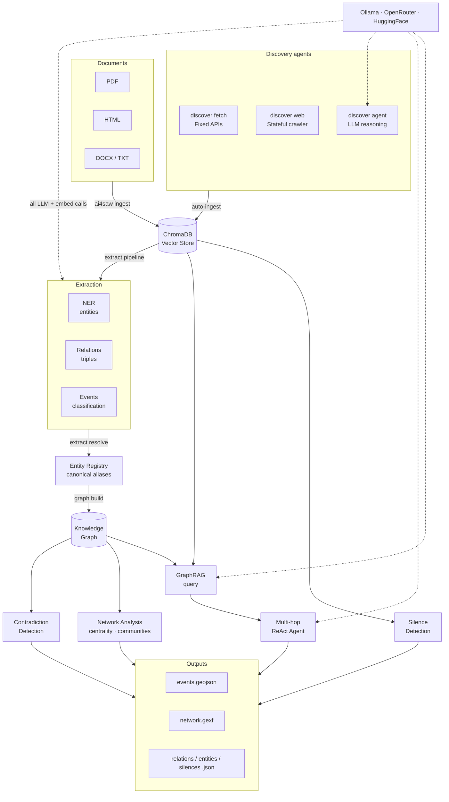

# Architecture

## Pipeline



## Data flow

```
corpus/                   ← source documents (PDFs, HTML, DOCX, TXT)
    │
    ▼ ai4saw ingest
ChromaDB                  ← vector store (chunked + embedded documents)
    │
    ▼ ai4saw extract pipeline
output/ner_results.json
output/relation_results.json
output/event_results.json
    │
    ▼ ai4saw extract resolve
data/entity_registry.json ← canonical entity registry with aliases
    │
    ▼ ai4saw graph build
data/knowledge_graph.json ← directed graph (entities as nodes, relations as edges)
    │
    ├─▶ ai4saw graph query / graph agent
    │       → LLM answer grounded in graph + vector context
    │
    ├─▶ ai4saw analyze network
    │       → output/network.json  (betweenness centrality, communities)
    │       → output/network.gexf  (Gephi visualisation)
    │
    ├─▶ ai4saw analyze contradictions
    │       → output/contradictions.json
    │
    └─▶ ai4saw export all
            → output/events.geojson
            → output/relations.json
            → output/entities.json
            → output/silences.json
            → output/corpus_stats.json
```

## Module map

```
ai4saw/
├── core/
│   ├── config.py          pydantic-settings env loading; singleton settings object
│   ├── models.py          all Pydantic v2 schemas — single source of truth
│   └── providers.py       get_llm() / get_embedder() — provider abstraction
│
├── ingestion/
│   ├── loaders.py         PDF/HTML/DOCX/TXT/URL → LangChain Documents
│   ├── chunker.py         RecursiveCharacterTextSplitter + metadata validation
│   └── embedder.py        deterministic-ID ChromaDB upsert (idempotent)
│
├── extraction/
│   ├── ner.py             few-shot NER, JSON parse retry, batch runner
│   ├── relations.py       chain-of-thought triple extraction
│   └── events.py          zero-shot → few-shot fallback at 0.6 confidence
│
├── retrieval/
│   ├── qa.py              MMR retrieval → cross-encoder rerank → cited answer
│   ├── reranker.py        cross-encoder/ms-marco-MiniLM-L-6-v2 (optional)
│   ├── graph_rag.py       knowledge graph build + temporal graph query
│   └── agent.py           LangGraph ReAct agent (search_corpus, graph_query, find_entity)
│
├── synthesis/
│   ├── entity_resolution.py  cosine + fuzzy union-find clustering
│   ├── contradiction.py      two-pass candidate gen + LLM verification
│   ├── network.py            betweenness centrality + Louvain community detection
│   ├── silence.py            expectation-gap + density-map silence detection
│   ├── export.py             GeoJSON / JSON / GEXF output
│   └── geocoder.py           stub — deferred to Phase 5
│
├── discovery/
│   └── discovery.py       ReliefWeb + GDELT API; deduplicates vs corpus/sources.csv
│
└── mcp_server.py          FastMCP server: search_corpus, graph_query, find_entity, ask_question
```

## Key design decisions

**Provider abstraction via factory functions.** `get_llm()` and `get_embedder()` in `providers.py` are the only places that reference a provider. Every other module calls these functions. Switching from Ollama to OpenRouter requires only a `.env` change.

**Single schema file.** All Pydantic models live in `core/models.py`. No schema definitions in individual modules. This prevents the schema fragmentation that typically accumulates across a large pipeline.

**Prompts as first-class artefacts.** Every LLM call loads its prompt from a versioned YAML file in `prompts/`. No prompt strings are hardcoded in Python. Every extraction run logs the prompt version used, making results reproducible.

**Idempotent ingestion.** Chunk IDs are deterministic SHA-256 hashes of `(filename, chunk_index)`. Re-running ingestion on the same corpus overwrites rather than duplicates.

**Two-layer retrieval.** MMR (maximal marginal relevance) retrieval reduces redundancy; cross-encoder reranking then re-scores for relevance. The cross-encoder degrades gracefully to the original ranking if not installed.

**Temporal edges in the knowledge graph.** Every edge carries `valid_from` and `valid_to` fields (ISO 8601). This enables queries like "what was the command structure in a specific date?" without rebuilding the graph.
